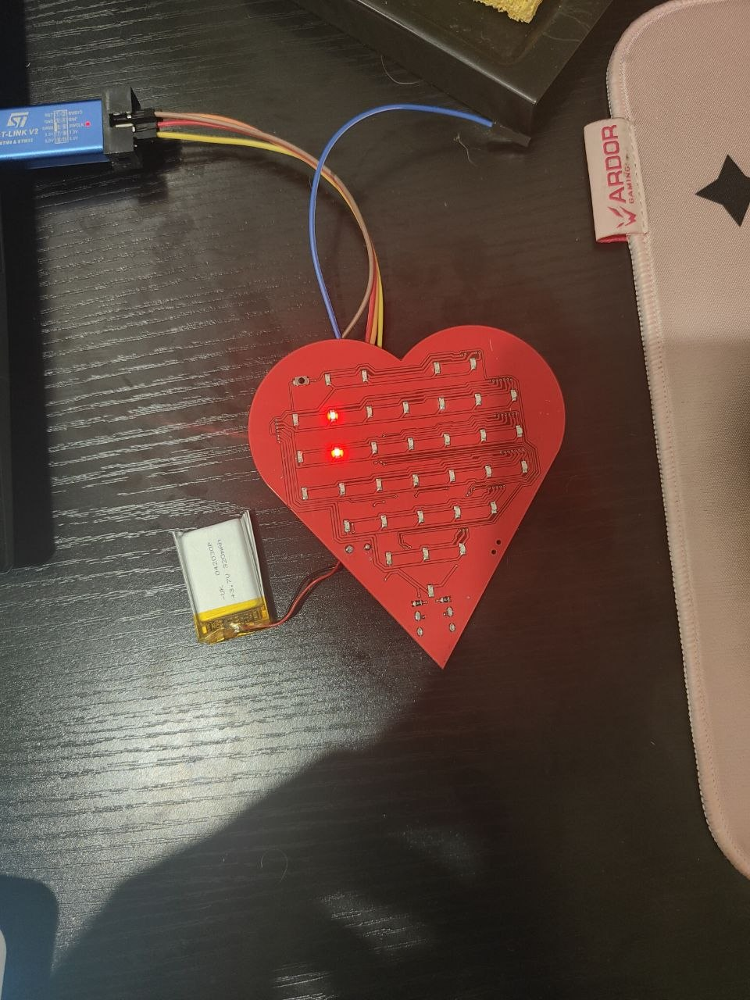
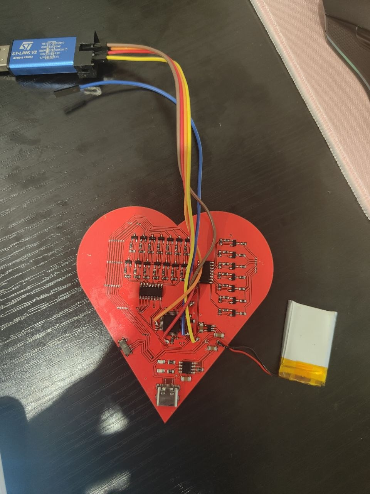

# ❤️ HeartLED-GIFT

<p align="center">
  <strong>Custom heart-shaped STM32 LED matrix</strong><br>
  Built around the STM32F103C8T6 with SPI-driven animations, custom PCB, Li-ion charging and a future 3D-printed enclosure.
</p>

<p align="center">
  
  
</p>

---

## ✨ Features

- ❤️ I LOVE YOU animation
- ❤️ Static heart
- ⭐ Starfall
- ☄️ Random comet
- 🔘 Button mode switching
- ⚡ SPI communication via 74HC595
- 💡 Software PWM brightness control
- 🎨 Custom heart-shaped PCB

---

## 🔧 Hardware

| Component | Description |
|-----------|-------------|
| MCU | STM32F103C8T6 |
| Shift Registers | 2 × 74HC595 |
| Display | Custom heart LED matrix |
| Power | Li-ion battery |
| Charging | USB Type-C |
| PCB | Custom 2-layer PCB |

---

## 🧠 Firmware

The firmware is written in **C** using **STM32 HAL**.

Implemented features:

- SPI communication
- LED multiplexing
- Frame-based animation engine
- Button debouncing
- Software PWM brightness control
- Microsecond timing
- Multiple display modes

---

## 🎬 Animation Modes

| Mode | Description |
|------|-------------|
| ❤️ | Static heart |
| 💌 | I LOVE YOU |
| ⭐ | Starfall |
| ☄️ | Random comet |

---

## 🖼 Gallery

### Top PCB

<p align="center">

</p>

### Bottom PCB

<p align="center">

</p>

---

## 📂 Repository Structure

```text
HeartLED-GIFT
│
├── HARDWARE
├── Images
├── Software
│   ├── TestRowsAndColumns
│   └── Release
├── LICENSE
└── README.md
```

---

## 🚧 Roadmap

- ✅ PCB design
- ✅ Firmware
- ✅ Multiple animation modes
- ⬜ 3D-printed enclosure
- ⬜ Final assembled board
- ⬜ Demo video

---

## 📜 License

Apache License 2.0
